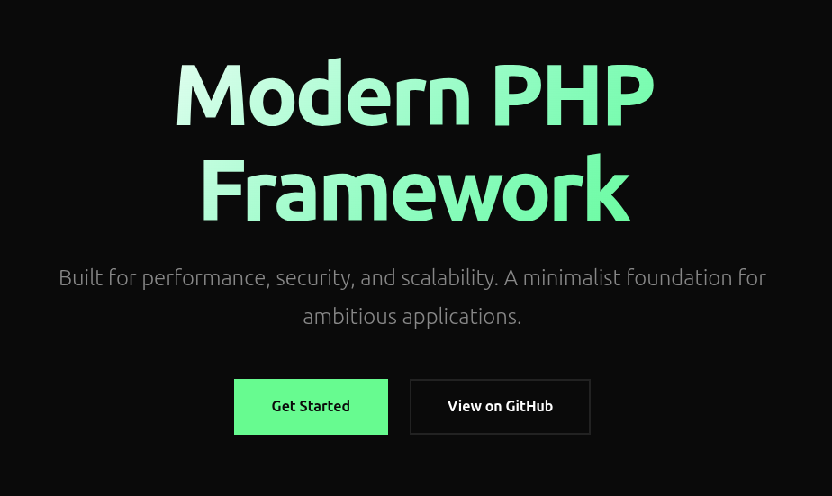

# Nexus PHP Framework

**Version 0.1.0** - Proof of Concept (PoC)

> **⚠️ WARNING: This is an experimental PoC, not production-ready**
> 
> This framework was created as a proof of concept using AI-assisted development (100% AI-generated code, zero manual coding). Version 0.1.0 was built in less than 5 hours as an exploration project.
> 
> **Do NOT use this codebase in production.** This is an experimental exploration project meant to evolve and learn from.

Modern PHP Framework with MySQL and Propel ORM, built with best practices and security in mind.

## Screenshot



## Features

- **Propel ORM 2.0** - Full ORM integration with type-safe queries
- **Database Migrations** - Version-controlled database schema
- **Database Seeders** - Data seeding system
- **Authentication System** - Login/logout with role-based access (user, admin, super_admin)
- **CSRF Protection** - Built-in CSRF token validation
- **Security Headers** - HSTS, X-Frame-Options, X-Content-Type-Options
- **Input Validation** - Comprehensive validation rules (required, email, unique, min, max, etc.)
- **Dependency Injection** - Custom container with service providers
- **Routing System** - RESTful routes with middleware support
- **View Rendering** - Template system with layouts
- **Error Handling** - Custom exception handlers with logging
- **Testing** - Comprehensive PHPUnit test suite (214+ tests)

## Requirements

- PHP 8.3+
- Composer
- Docker & Docker Compose (for MySQL)
- MySQL 8.0+

## Installation

1. Clone the repository
2. Copy `.env.example` to `.env` and configure your settings
3. Install dependencies: `composer install`
4. Generate Propel configuration and models:
   ```bash
   vendor/bin/propel config:convert
   vendor/bin/propel model:build
   ```
5. Start MySQL container: `./scripts/docker-start.sh` or `docker compose up -d`
6. Run migrations and seeders: `php scripts/fresh.php`

## Quick Start

```bash
# Install dependencies
composer install

# Start MySQL
docker compose up -d

# Setup database (fresh migration + seeders)
php scripts/fresh.php

# Start development server
php -S localhost:8000 -t public
```

Access: http://localhost:8000

**Default test accounts:**
- Super Admin: `superadmin@example.com` / `superadmin123`
- Admin: `admin@example.com` / `admin123`
- User: `user@example.com` / `user123`

## Docker MySQL

The project uses Docker Compose for MySQL:

```bash
# Start MySQL (runs on port 3307)
./scripts/docker-start.sh
# or
docker compose up -d

# Stop MySQL
./scripts/docker-stop.sh
# or
docker compose down

# View logs
./scripts/docker-logs.sh
# or
docker compose logs -f mysql
```

**Note:** MySQL runs on port **3307** (not 3306) to avoid conflicts with local MySQL instances.

## Database Management

### Migrations

```bash
# Run pending migrations
php scripts/migrate.php run

# Rollback last migration
php scripts/migrate.php rollback

# Rollback N migrations
php scripts/migrate.php rollback 3
```

### Seeders

```bash
# Run all seeders
php scripts/seed.php

# Run specific seeder
php scripts/seed.php 20240101000000_DefaultUsersSeeder
```

### Fresh Database

```bash
# Drop all tables, run migrations and seeders
php scripts/fresh.php
```

## Propel ORM

### Initial Setup

After cloning the repository, generate Propel configuration and models:

```bash
# Generate Propel configuration
vendor/bin/propel config:convert

# Generate models from schema.xml
vendor/bin/propel model:build
```

This generates:
- `generated-conf/` - Propel runtime configuration (auto-generated, gitignored)
- `app/Models/Base/` - Base model classes (auto-generated)
- `app/Models/` - Extendable model classes
- `app/Models/Map/` - Table maps

**Note:** Generated files are in `.gitignore`. Run these commands after cloning.

### Usage Example

```php
use App\Models\User;
use App\Models\UserQuery;

// Find user by ID
$user = UserQuery::create()->findPk(1);

// Find by email
$user = UserQuery::create()->findOneByEmail('user@example.com');

// Filter and order
$admins = UserQuery::create()
    ->filterByRole('admin')
    ->orderByCreatedAt('DESC')
    ->find();

// Create user
$user = new User();
$user->setEmail('new@example.com');
$user->setPassword($hashedPassword);
$user->setName('New User');
$user->save();
```

## Testing

```bash
# Run all tests
./vendor/bin/phpunit

# Run specific test suite
./vendor/bin/phpunit tests/framework/Database
```

**Test Coverage:** 214 tests, 346+ assertions

## Project Structure

```
app/
├── Exceptions/          # Custom exceptions
├── Http/
│   ├── Controllers/     # Request handlers
│   ├── Middlewares/     # HTTP middlewares
│   ├── Requests/        # Form request validation
│   ├── Request.php      # HTTP request wrapper
│   ├── Response.php     # HTTP response builder
│   └── Router.php       # Routing system
├── Models/              # Propel ORM models
│   ├── Base/            # Auto-generated base classes
│   └── Map/             # Table maps
├── Providers/           # Service providers
├── Repositories/
│   ├── Connectors/      # Database connectors (Propel)
│   └── User/            # Domain repositories
├── Services/            # Business logic services
└── Database/
    ├── Migrations/      # Migration runner
    └── Seeders/         # Seeder runner

bootstrap/               # Framework initialization
config/                  # Configuration files
database/
├── migrations/          # Migration files
└── seeders/             # Seeder files
public/                  # Web root
resources/views/         # Templates
routes/                  # Route definitions
storage/                 # Logs, cache, sessions
tests/                   # Test suites
```

## Architecture

The framework follows a layered architecture:

```
Controller → Service → Repository → Connector (Propel) → Database
```

- **Controllers**: Handle HTTP requests/responses
- **Services**: Business logic and validation
- **Repositories**: Data access abstraction
- **Connectors**: Propel ORM implementation (encapsulated)

## Security Features

- CSRF token validation
- Password hashing (bcrypt)
- SQL injection protection (Propel ORM)
- XSS protection (input sanitization)
- Security headers (HSTS, X-Frame-Options, etc.)
- Role-based access control

## About This Project

This is a **Proof of Concept (PoC)** created entirely through AI-assisted development:
- **100% AI-generated code** - No manual coding was done
- **Built in < 5 hours** - Version 0.1.0 development time
- **Experimental exploration** - Meant to evolve and learn from
- **Not production-ready** - Do not use in production environments

This project serves as an exploration of modern PHP framework architecture, Propel ORM integration, and AI-assisted development workflows.

## License

MIT License - see [LICENSE](LICENSE) file for details.
